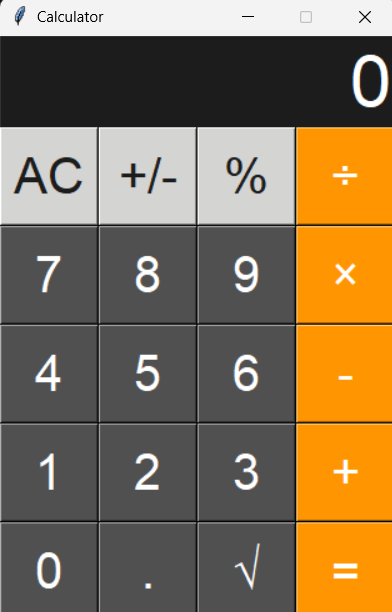

# 🧮 Python GUI Calculator

A calculator application built using Python and Tkinter.

## 📷 Screenshot



## Features

- Addition
- Subtraction
- Multiplication
- Division
- Square Root
- Percentage
- Sign Change (+/-)
- Decimal Support

---

## 🛠️ Technologies Used

- Python 3
- Tkinter (GUI)
- Math Module

---

## 📂 Project Structure

```
Calculator/
│── calculator.py
│── README.md
```

---

## ▶️ How to Run

### 1. Clone the repository

```bash
git clone https://github.com/your-username/Calculator.git
```

### 2. Navigate to the project folder

```bash
cd Calculator
```

### 3. Run the application

```bash
python calculator.py
```

---

## 📷 Preview

The calculator includes a graphical interface with:

- Number buttons (0–9)
- Basic arithmetic operators
- Square root function
- Percentage function
- Sign change (+/-)
- Decimal point support
- Clear (AC) button

---

## 🚀 Future Improvements

- Keyboard input support
- Scientific calculator functions (sin, cos, tan, log)
- Calculation history
- Memory functions (M+, M-, MR, MC)
- Dark and Light theme switch
- Error handling for division by zero
- Better UI design and responsive layout

---

## 📖 Concepts Used

- Variables
- Functions
- Conditional Statements
- Loops
- Lists
- Global Variables
- Tkinter Widgets
- Lambda Functions
- Math Module
- Event Handling

---

## 👩‍💻 Author

**Alisha Pathak**

GitHub: https://github.com/lisha-cpu

---

## 📜 License

This project is created for learning and educational purposes.
